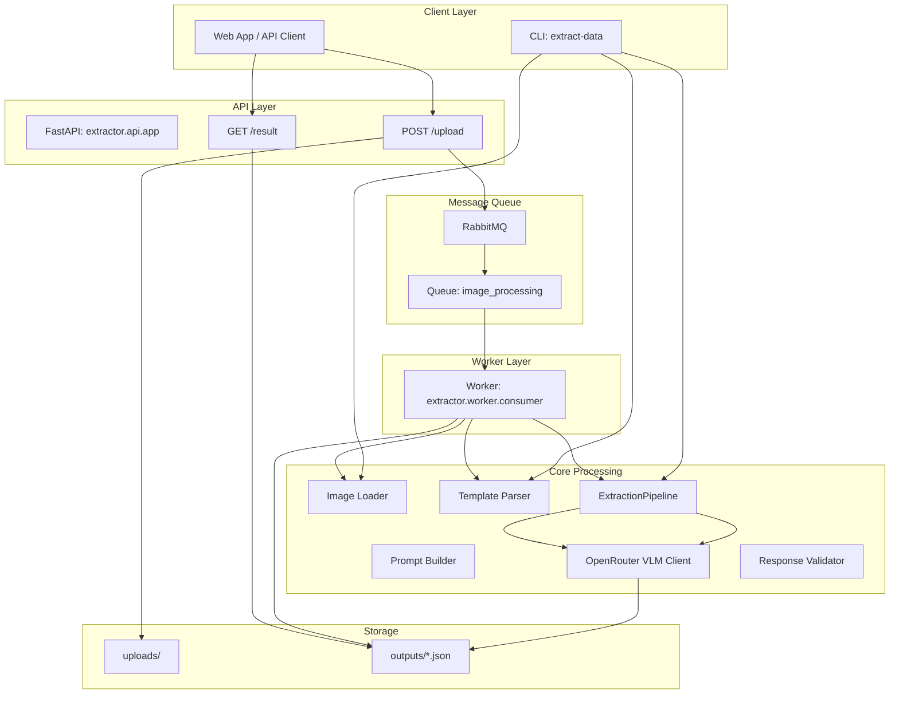

# Medical Result VLM Extractor

Dự án này là công cụ tự động trích xuất thông tin từ hình ảnh giấy tờ, phiếu kết quả khám bệnh hoặc hồ sơ y tế bằng Vision Language Model (VLM) thông qua OpenRouter API.

## Tính Năng
- **VLM Extraction**: Sử dụng Gemini 1.5 Pro, GPT-4o, Claude 3 để chuyển đổi ảnh xét nghiệm sang JSON
- **Template-based**: Điền dữ liệu theo `template.json` định sẵn
- **Auto-retry**: Tự động retry khi VLM trả về JSON không hợp lệ
- **Async Processing**: Hỗ trợ RabbitMQ queue cho web app integration

## Yêu Cầu
- Python 3.10+
- [uv](https://github.com/astral-sh/uv) (recommended)

## Cài Đặt

```bash
# Clone và cd vào thư mục
git clone https://github.com/108-PJIOrthoGen/Extract_data_from_images.git
cd Extract_data_from_images

# Cài đặt dependencies
uv sync
pip install -e .
```

## Cấu Hình

Copy `.env.example` thành `.env` và thêm API key:
```env
OPENROUTER_API_KEY="your_api_key_here"
OPENROUTER_MODEL="google/gemini-1.5-pro"
```

## Tổ Chức Thư Mục

```
Extract_data_from_images/
├── src/extractor/               # Main package
│   ├── api/                     # FastAPI application
│   │   ├── app.py              # App factory + lifespan
│   │   └── routes.py           # API endpoints
│   ├── clients/                 # External API clients
│   │   └── vlm_client.py        # OpenRouter VLM client
│   ├── core/                    # Domain logic
│   │   ├── extractor.py        # ExtractionPipeline orchestrator
│   │   ├── prompt_builder.py   # Prompt construction
│   │   ├── response_validator.py # Validation logic
│   │   └── template_parser.py  # Template parsing
│   ├── loaders/                 # Input adapters
│   │   └── image_loader.py     # Image loading & Base64 encoding
│   ├── models/                  # Pydantic schemas
│   │   └── template.py         # Template validation
│   ├── worker/                  # RabbitMQ consumer
│   │   └── consumer.py         # Async message consumer
│   ├── utils/
│   │   └── logger.py           # Logging configuration
│   ├── config.py               # Settings with validation
│   ├── exceptions.py           # Exception hierarchy
│   └── main.py                 # CLI entry point
├── tests/                       # Unit tests
├── templates/
│   └── template.json           # JSON template
├── images/                      # Input images
├── outputs/                    # Output JSON files
├── Dockerfile
├── docker-compose.yml
├── Makefile
└── pyproject.toml
```

## Cách Sử Dụng

### CLI (Command Line)
```bash
# Chạy với thư mục ảnh mặc định
uv run extract-data --input images/test_case_01

# Tùy chọn thêm
uv run extract-data --input images/test_case_01 --output custom_output.json
uv run extract-data --input images/test_case_01 --max-retries 3
```

### Sử dụng Makefile (Recommended)
```bash
make install      # Cài đặt dependencies
make dev         # Cài đặt dev dependencies
make run         # Chạy CLI
make run-api     # Chạy FastAPI server
make run-worker  # Chạy RabbitMQ worker
make test        # Chạy tests
make lint        # Kiểm tra code style
```

### Docker
```bash
docker-compose up --build
```

## API Endpoints

| Method | Endpoint | Mô tả |
|--------|----------|-------|
| POST | `/upload` | Upload 1 hoặc nhiều ảnh, gửi vào queue |
| GET | `/result/{job_id}` | Lấy kết quả JSON theo job_id |
| GET | `/health` | Health check |

### Upload Ảnh
```bash
# Upload 1 ảnh
curl -X POST http://localhost:8000/upload \
  -F "files=@image.jpg"

# Upload nhiều ảnh
curl -X POST http://localhost:8000/upload \
  -F "files=@page1.jpg" \
  -F "files=@page2.jpg"
```

### Kiểm Tra Kết Quả
```bash
# Poll kết quả
curl http://localhost:8000/result/{job_id}

# Response khi đang xử lý:
# {"job_id": "...", "status": "processing"}

# Response khi hoàn thành:
# {"job_id": "...", "status": "completed", "data": {...}}
```

## RabbitMQ Configuration

Thêm vào `.env`:
```env
RABBITMQ_HOST=localhost
RABBITMQ_PORT=5672
RABBITMQ_USER=guest
RABBITMQ_PASSWORD=guest
RABBITMQ_QUEUE=image_processing
```

## Development

```bash
# Cài đặt dev dependencies
pip install -e ".[dev]"

# Chạy tests
pytest -v

# Chạy lint
ruff check .
ruff format --check .

# Pre-commit hooks
pre-commit install
```

## Architecture



### Luồng Xử Lý Chi Tiết

```mermaid
sequenceDiagram
    participant Client
    participant API
    participant MQ
    participant Worker
    participant VLM
    participant FS

    Client->>FS: Read images
    FS->>Client: Return images

    Client->>API: Upload files
    API->>FS: Save images
    API->>MQ: Publish message

    MQ->>Worker: Consume message

    Worker->>FS: Read images
    Worker->>FS: Read template
    Worker->>VLM: Call API

    loop Retry
        VLM->>Worker: Response
        Worker->>Worker: Validate
        alt Invalid
            Worker->>VLM: Retry
        else Valid
            break
        end
    end

    Worker->>FS: Save result

    Client->>API: Get result
    API->>FS: Read result
    API->>Client: Return JSON
```

## License

[MIT](LICENSE)