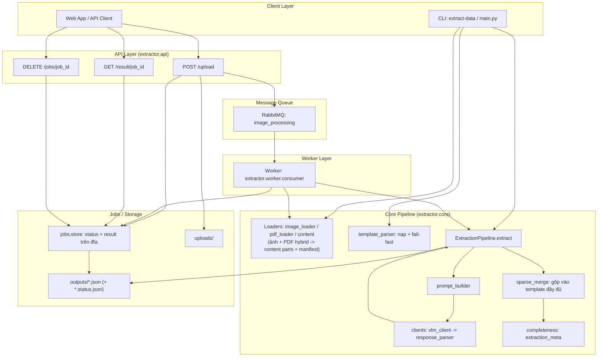
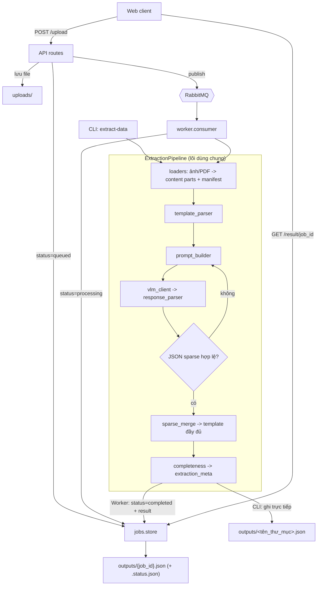

# Medical Result VLM Extractor

Dự án này là công cụ tự động trích xuất thông tin từ **ảnh** (JPG/PNG/WebP/HEIC/HEIF...) hoặc **PDF** giấy tờ, phiếu kết quả khám bệnh, hồ sơ y tế bằng Vision Language Model (VLM) thông qua OpenRouter API.

## Tính Năng
- **Đa định dạng (PDF hybrid)**: Nhận cả ảnh và PDF. PDF số hóa được **trích thẳng text layer** (chính xác, rẻ, đúng dấu tiếng Việt); PDF scan thì **render thành ảnh** (PyMuPDF) cho VLM. Cả hai đi chung một pipeline.
- **Ảnh từ điện thoại**: HEIC/HEIF được giải mã trong bộ nhớ và chuyển thành JPEG chất lượng cao trước khi gửi vào VLM.
- **Gộp theo bệnh nhân**: Nhiều phiếu (PDF + ảnh) của cùng một bệnh nhân được đọc hết và gộp vào **một bản ghi JSON** duy nhất.
- **Template tổng quát, điền tối đa**: `template.json` là biểu mẫu đầy đủ các nhóm xét nghiệm. Model **giữ nguyên toàn bộ trường**, điền giá trị tìm được; trường nào không có trong tài liệu thì để `null` — **không bao giờ bị xóa**.
- **Validate đủ trường**: Bắt buộc output chứa **tất cả** key của template (tự động retry nếu thiếu), đảm bảo không sót dữ liệu.
- **PDF ghi đè ảnh (ưu tiên mới nhất)**: PDF là dữ liệu bổ sung sau khi chụp ảnh; trường nào trùng giữa ảnh và PDF thì lấy PDF. Mỗi nhóm gắn `metadata.source_type` = `pdf`/`image`.
- **Tự kiểm tra & cảnh báo (`extraction_meta`)**: Mỗi kết quả kèm khối chẩn đoán báo nhóm trống (`empty_groups`/`has_missing_data`), tỉ lệ điền thấp (`low_fill_rate`), file rác kèm lý do (`unrecognized_sources`) và `warnings` sẵn cho backend nhắc user upload bổ sung / đúng phiếu.
- **Tối ưu tốc độ (sparse extraction)**: VLM chỉ trả về dữ liệu tìm được (không chép lại scaffold tĩnh), code merge vào template đầy đủ → output cuối **vẫn đủ mọi trường** nhưng nhanh hơn ~35–50% (output ngắn hơn nhiều). Thêm routing provider `throughput` + timeout. `abnormal_flags_summary` được **tính tự động** từ flag (chính xác, không cần model suy đoán).
- **Async Processing**: Hỗ trợ RabbitMQ queue cho web app integration.

## Yêu Cầu
- Python 3.10+
- [uv](https://github.com/astral-sh/uv) (recommended)

## Cài Đặt

```bash
# Clone và cd vào thư mục
git clone https://github.com/108-PJIOrthoGen/Extract_data_from_images.git
cd Extract_data_from_images

# Tạo và kích hoạt virtual environment
python -m venv .venv

# Linux / macOS
source .venv/bin/activate

# Windows (PowerShell)
.venv\Scripts\Activate

# Kiểm tra đã active chưa
which python  # Linux/macOS
Get-Command python  # Windows

# Cài đặt dependencies (gồm cả PyMuPDF để đọc/render PDF)
uv sync                          # hoặc: make install
# Khi cần chạy test/lint -> cài thêm dev deps:
uv pip install -e ".[dev]"       # hoặc: make dev
```

## Cấu Hình

Copy `.env.example` thành `.env` và điền API key. Các biến hỗ trợ:

```env
# OpenRouter (bắt buộc)
OPENROUTER_API_KEY=your_openrouter_api_key_here
OPENROUTER_MODEL=google/gemini-1.5-pro      # hoặc openai/gpt-4o, anthropic/claude-... 

# Tốc độ phản hồi
OPENROUTER_PROVIDER_SORT=throughput   # route tới provider nhanh nhất ("" = mặc định OpenRouter)
VLM_TIMEOUT_CONNECT=10                # timeout kết nối (giây)
VLM_TIMEOUT_READ=180                  # timeout đọc kết quả (giây) — tránh treo vô hạn

# Xử lý PDF (hybrid)
PDF_TEXT_MIN_CHARS=100   # trang PDF >= ngần này ký tự text -> gửi dạng TEXT; ít hơn -> render ảnh
PDF_RENDER_DPI=150       # DPI khi render trang PDF/scan thành ảnh

# Cảnh báo chất lượng trích xuất
LOW_FILL_RATE_THRESHOLD=0.5   # fill_rate dưới ngưỡng này -> bật cờ low_fill_rate + warning

# Tùy chọn nâng cao (có default, không bắt buộc)
# VLM_MAX_TOKENS=32768   # token tối đa cho output (template lớn -> để cao tránh bị cắt)
# VLM_MAX_RETRIES=5      # số lần retry khi JSON sai/thiếu trường
# RABBITMQ_HOST=localhost RABBITMQ_PORT=5672 RABBITMQ_USER=guest RABBITMQ_PASSWORD=guest RABBITMQ_QUEUE=image_processing
```

> Riêng PyMuPDF (đọc/render PDF) được cài tự động theo `pyproject.toml`, không cần cấu hình thêm.

## Tổ Chức Thư Mục

```
Extract_data_from_images/
├── src/extractor/                 # Main package
│   ├── api/                       # FastAPI application
│   │   ├── app.py                 # App factory + lifespan
│   │   └── routes.py              # API endpoints (dùng jobs.store)
│   ├── worker/                    # RabbitMQ consumer
│   │   └── consumer.py            # Async message consumer (dùng jobs.store)
│   ├── jobs/                      # Vòng đời job trên đĩa (status + result)
│   │   └── store.py               # JobStatus enum + read/write/is_cancelled/paths
│   ├── clients/                   # External API clients
│   │   ├── vlm_client.py          # OpenRouter VLM client
│   │   └── response_parser.py     # Làm sạch response (gỡ markdown fence)
│   ├── core/                      # Domain logic
│   │   ├── extractor.py           # ExtractionPipeline (gọi VLM -> validate -> retry -> meta)
│   │   ├── prompt_builder.py      # Dựng prompt (điền template, ưu tiên PDF, nhận diện file rác)
│   │   ├── sparse_merge.py        # Merge payload sparse vào template đầy đủ
│   │   ├── completeness.py        # Tính extraction_meta (thiếu dữ liệu / file rác)
│   │   ├── template_parser.py     # Nạp template (fail-fast nếu JSON hỏng)
│   │   ├── test_tree.py           # Helper duyệt cây test/sub_test (dùng chung)
│   │   └── schema_keys.py         # Hằng số tên section/field của template
│   ├── loaders/                   # Input adapters
│   │   ├── constants.py           # Một nguồn extension/MIME/content-type
│   │   ├── content.py             # Content part builders (text / image)
│   │   ├── image_loader.py        # Dispatch ảnh/PDF -> content parts + manifest
│   │   └── pdf_loader.py          # PDF hybrid: text layer hoặc render ảnh (PyMuPDF)
│   ├── utils/
│   │   └── logger.py              # Logging configuration
│   ├── config.py                  # Settings (pydantic-settings) + validate_runtime()
│   ├── exceptions.py              # Exception hierarchy
│   ├── observability.py           # OpenTelemetry tracing bootstrap (opt-in)
│   └── main.py                    # CLI entry point
├── tests/                         # Unit tests
├── templates/
│   └── template.json              # Template tổng quát (biểu mẫu đầy đủ)
├── data/
│   ├── images/test_case_01/       # Ảnh phiếu mẫu (page_1..n)
│   └── pdf/                        # PDF phiếu mẫu
├── outputs/                       # Output JSON files
├── Dockerfile
├── docker-compose.yml
├── Makefile
└── pyproject.toml
```

## Cách Sử Dụng

### CLI (Command Line)

`--input` trỏ tới **một thư mục** chứa ảnh và/hoặc PDF của **một bệnh nhân**; toàn bộ file trong đó
được gộp thành một kết quả. Mặc định: `data/images/test_case_01`.

```bash
# Chạy với thư mục ảnh mẫu (mặc định)
uv run extract-data --input data/images/test_case_01

# Chạy với thư mục PDF (PDF số hóa -> đi đường text)
uv run extract-data --input data/pdf

# Trộn ảnh + PDF cùng 1 bệnh nhân: bỏ chung 1 thư mục rồi trỏ --input vào đó
uv run extract-data --input duong/dan/thu_muc_ca_benh

# Các cờ tùy chọn
uv run extract-data --input data/pdf --output outputs/ket_qua.json
uv run extract-data --input data/pdf --model openai/gpt-4o
uv run extract-data --input data/pdf --max-retries 3
```

Kết quả mặc định lưu tại `outputs/<tên_thư_mục>.json`.

### Sử dụng Makefile (Recommended)
```bash
make install      # Cài đặt dependencies (uv sync)
make dev          # Cài đặt dev dependencies (uv pip install -e ".[dev]")
make run          # Chạy CLI trên data/images/test_case_01
make run-pdf      # Chạy CLI trên data/pdf
make run-api      # Chạy FastAPI server (port 8000)
make run-worker   # Chạy RabbitMQ worker
make test         # Chạy tests
make lint         # Kiểm tra code style
```

### Docker
```bash
docker-compose up --build
```

## API Endpoints

| Method | Endpoint | Mô tả |
|--------|----------|-------|
| POST | `/upload` | Upload 1 hoặc nhiều file (ảnh hoặc PDF) của 1 bệnh nhân, gửi vào queue |
| GET | `/result/{job_id}` | Lấy kết quả JSON theo job_id |
| DELETE | `/jobs/{job_id}` | Hủy job và xóa kết quả/trạng thái còn lưu |
| GET | `/health` | Health check |

### Upload File (ảnh và/hoặc PDF)
```bash
# Upload 1 file
curl -X POST http://localhost:8000/upload \
  -F "files=@image.jpg"

# Upload nhiều file của 1 bệnh nhân (ảnh + PDF lẫn lộn) -> gộp thành 1 kết quả
curl -X POST http://localhost:8000/upload \
  -F "files=@phieu_huyet_hoc.pdf" \
  -F "files=@phieu_vi_sinh.pdf" \
  -F "files=@anh_tong_hop.jpg"
```

> Định dạng hỗ trợ: `.jpg .jpeg .png .webp .pdf` (tối đa 25 file, 15MB/file).

### Kiểm Tra Kết Quả
```bash
# Poll kết quả
curl http://localhost:8000/result/{job_id}

# Response khi đang xử lý:
# {"job_id": "...", "status": "processing"}

# Response khi hoàn thành:
# {"job_id": "...", "status": "completed", "data": {...}}
```

## Cấu Trúc Output Đầu Ra

`data` (cũng là file `outputs/*.json` khi chạy CLI) bám sát `template.json` và thêm một khối
chẩn đoán `extraction_meta`. Cấu trúc tổng quát:

```jsonc
{
  "document": {            // thông tin phiếu: title, hospital, record_number, report_number,
    "...": "..."           //                  patient_code, priority, exam_date...
  },
  "patient": {             // hành chính: full_name, age, year_of_birth, gender, address,
    "...": "..."           //             card_number (BHYT), insurance_expiry, phone,
  },                       //             current_department, ordering_department, room, bed...
  "test_results": {
    "section_1_xet_nghiem": {                 // các nhóm xét nghiệm (huyết học, vi sinh, sinh hóa...)
      "group_8_dong_mau_C13_coagulation": {
        "department": "Khoa Huyết học",
        "time_collected": "06:03 07/04/2026",
        "time_resulted": "",
        "tests": [
          { "stt": 8, "name": "Định lượng Fibrinogen (FIB-C1)...",
            "value": 5.67, "flag": "H", "reference_range": "2 - 4", "unit": "g/L",
            "note": null, "process_code": "QTXN.108.HH", "device": "ACLTOP750_1" }
          // test có thể chứa "sub_tests" (vd PT-RP(s), PT-RP(%), INR...)
        ],
        "metadata": {                          // metadata theo từng phiếu (slip)
          "source_type": "pdf",                // "pdf" | "image" (ưu tiên dữ liệu PDF mới nhất)
          "report_number": "40013653", "barcode": "...", "form_code": "15/BV-1",
          "sample_collector": "Nguyễn Hồng Tráng", "sample_receiver": "...",
          "sample_type": "Huyết tương (CITRATE)", "sample_condition": "Đạt",
          "result_approval_time": "06:47 07/04/2026", "approved_by": "...",
          "print_time": "07:14 07/04/2026", "treating_doctor": "Trần Hoàng Minh",
          "lab_technician": "...", "department_head": "...", "supervisor": "",
          "signed_by": "Nguyễn Gia Vũ", "remarks": "Đã kiểm tra...",
          "effective_date": "01/12/2024", "page_info": "Trang 1/1"
        }
      }
      // ... group_1 .. group_10
    },
    "section_2_chan_doan_hinh_anh": {           // X-quang... -> { name, result, note, source_type }
      "exam_1_xray_knee": { "name": "", "result": "", "note": "", "source_type": "" }
    },
    "section_3_tham_do_chuc_nang": {            // ECG, siêu âm... (cùng dạng exam như trên)
      "exam_1_ecg": { "name": "", "result": "", "note": "", "source_type": "" }
    }
  },
  "abnormal_flags_summary": {                    // TỰ ĐỘNG tính từ flag (H/L) + cấy dương tính
    "HIGH": [ { "test": "CRP", "value": 118.4, "unit": "mg/l", "reference": "0-5" } ],
    "LOW":  [ ... ],
    "POSITIVE_CULTURE": [ { "test": "...", "organism": "Enterococcus faecium" } ]
  },
  "extraction_meta": { /* xem mục dưới — báo file đã xử lý + thiếu/sai dữ liệu */ }
}
```

**Quy ước điền dữ liệu:**
- Mọi key của `template.json` đều có mặt; trường không tìm thấy → `null` (hoặc `""`), **không bị xóa**.
- `flag`: `"H"` (cao) / `"L"` (thấp) / `null`. `reference_range`, `unit`, `name` chuẩn được giữ sẵn.
- Trùng giá trị giữa ảnh và PDF → **lấy PDF** (mới hơn); `metadata.source_type` ghi nguồn của nhóm đó.
- `abnormal_flags_summary` được hệ thống **tính tự động** từ các `flag` H/L (không do model suy đoán).
- *(Nội bộ)* Để nhanh hơn, VLM chỉ trả về **dữ liệu tìm được** (sparse) rồi code merge vào template — output bạn nhận **vẫn đầy đủ mọi trường** như trên.

### Thư Mục `outputs/` — Mỗi File Là Gì?

> ⚠️ Làm rõ: **chỉ có MỘT** FastAPI server (vd `http://localhost:8000`). Mỗi lần `/upload` **không** tạo server / localhost mới — chỉ sinh một **`job_id`** (UUID). Lấy kết quả ở **cùng host, khác đường dẫn**: `GET /result/{job_id}`.

Một lần xử lý sinh các file sau trong `outputs/`:

| File | Nhiệm vụ | Khi nào tạo |
|---|---|---|
| `{job_id}.status.json` | **Trạng thái** job: `queued` / `processing` / `completed` / `failed` / `cancelled` (+ `updated_at`, `error`, `file_count`). API `/result` đọc file này trước tiên. | Ngay khi `/upload` (luồng API) |
| `{job_id}.json` | **Kết quả** trích xuất cuối cùng — chính là `data` mà `/result` trả về (đầy đủ template + `extraction_meta`). | Khi job `completed` |
| `<tên_thư_mục>.json` | Kết quả khi chạy **CLI** `extract-data --input <thư_mục>` (vd `outputs/test_case_01.json`). CLI chạy đồng bộ nên **không** có file status. | Sau khi CLI chạy xong |

> Các file `case_*.json` đang có là **output mẫu/test khi phát triển** — xóa được an toàn.

**Mỗi lần upload = một `job_id` mới = bộ file mới** (không ghi đè job cũ). Đây là lý do `outputs/` có nhiều file: mỗi `job_id` để lại 2 file (`.json` + `.status.json`).

### Vòng đời ảnh/PDF upload

Ảnh/PDF được lưu tạm ở `uploads/<job_id>/` chỉ để worker đọc sau khi nhận message RabbitMQ. Worker xóa thư mục này ngay khi job đạt trạng thái `completed`, `failed` hoặc `cancelled`; khi worker khởi động, nó cũng dọn các thư mục terminal còn sót từ lần chạy trước. Vì vậy `uploads/` không tích lũy ảnh đã xử lý.

Kết quả và trạng thái vẫn nằm ở `outputs/` để `GET /result/{job_id}` hoạt động. Đây có thể chứa dữ liệu y tế; hệ thống tích hợp nên đặt chính sách lưu giữ/xóa riêng cho `outputs/` và gọi `DELETE /jobs/{job_id}` khi không còn cần truy vấn kết quả.

### Upload Bổ Sung (khi báo thiếu) — tạo job MỚI, KHÔNG sửa file cũ

Hệ thống gộp toàn bộ phiếu trong **một lần gọi VLM** (re-run cả set). Khi user bổ sung file:
- Backend **gửi lại CẢ bộ file** (cũ + mới) qua `/upload` → sinh **`job_id` MỚI** → **file mới** `{job_id_moi}.json` + `.status.json`.
- File của job cũ **KHÔNG** được cập nhật (job_id khác nhau).
- Backend nên: lưu mapping `bệnh nhân → job_id mới nhất`, hiển thị job mới nhất cho user, và **dọn kết quả job cũ** bằng `DELETE /jobs/{job_id}` (ảnh/PDF nguồn đã được worker tự xóa khi job kết thúc).

> 💡 Khuyến nghị vận hành: chạy cron/script dọn định kỳ các file job cũ (theo `updated_at` trong `.status.json`) để `outputs/` không phình to.

### Phát Hiện Thiếu Dữ Liệu (`extraction_meta`)

Mỗi kết quả (`data`) có thêm khối `extraction_meta`. Phần `completeness` được tính **bằng code**
(đếm trường có giá trị — luôn chính xác); riêng `unrecognized_sources` do VLM nhận diện file rác.
Nếu bác sĩ upload thiếu một phiếu, nhóm tương ứng sẽ trống và bị liệt kê trong `empty_groups` —
backend dùng tín hiệu này để nhắc user bổ sung file rồi upload lại.

```jsonc
"extraction_meta": {
  "processed_files": [               // các file đã xử lý (tên, loại, số trang)
    { "file": "document_1.pdf", "type": "pdf", "mode": "text", "pages": 1 }
  ],
  "unrecognized_sources": [          // file KHÔNG phải phiếu XN / không khớp template (kèm lý do)
    { "file": "hoa_don_dien.pdf", "reason": "Đây là hóa đơn tiền điện, không phải phiếu xét nghiệm" }
  ],
  "warnings": [                      // câu chữ sẵn cho backend hiển thị cho user
    "Ti le dien thap (1%) - co the thieu phieu hoac anh mo/kho doc.",
    "9 nhom xet nghiem chua co du lieu - co the thieu phieu.",
    "File khong lien quan/khong nhan dien duoc: hoa_don_dien.pdf."
  ],
  "completeness": {
    "total_test_fields": 75,
    "filled_test_fields": 7,
    "fill_rate": 0.093,
    "low_fill_rate": true,            // true = đã có data nhưng fill_rate < ngưỡng (LOW_FILL_RATE_THRESHOLD)
    "has_usable_data": true,          // false = không trích xuất được gì (file rác/không đọc được)
    "empty_groups": [ "group_3_vi_sinh_B1C_culture_1", ... ],  // nhóm KHÔNG có data -> nghi thiếu phiếu
    "partial_groups": [ ... ],        // nhóm điền dở dang
    "empty_imaging": [ ... ],
    "empty_functional": [ ... ],
    "has_missing_data": true          // cờ tổng cho backend
  }
}
```

Các cờ tín hiệu cho backend:
- **`has_usable_data=false`** → upload toàn file rác/không đọc được → "vui lòng upload đúng phiếu".
- **`unrecognized_sources`** → file cụ thể không hợp lệ, kèm `reason` để báo user chính xác.
- **`low_fill_rate=true`** → có data nhưng điền quá ít (`< LOW_FILL_RATE_THRESHOLD`, mặc định 0.5) → nghi còn thiếu phiếu hoặc ảnh mờ/khó đọc.
- **`empty_groups` / `has_missing_data`** → nhóm xét nghiệm còn trống → nhắc bổ sung phiếu khoa đó.
- **`warnings`** → mảng câu chữ tiếng Việt sẵn sàng hiển thị (tổng hợp các cờ trên).

**Bổ sung file sau khi đã upload**: hệ thống gộp tất cả phiếu trong **một lần gọi VLM**, nên khi
thêm 1 ảnh/PDF mới (chèn ở bất kỳ vị trí nào) cần **upload lại toàn bộ** file của ca đó (re-submit
cả job). Cách này đơn giản và chính xác; chi phí thấp vì PDF đi đường text. Thứ tự file không quan
trọng — mỗi phiếu được nhận diện theo nội dung.

### Fallback / Tình Huống Lỗi

| Tình huống | API trả về | Backend nên làm |
|---|---|---|
| **Upload nhầm file không liên quan** (ảnh/PDF không phải phiếu XN) | `unrecognized_sources` liệt kê file đó **kèm `reason`**; nếu **toàn bộ** file rác thì `has_usable_data=false`, `fill_rate=0` | Báo user theo `reason` (vd "file X là hóa đơn, không phải phiếu xét nghiệm") |
| **Thiếu 1 phiếu** | `empty_groups` chứa nhóm trống, `has_missing_data=true`, `has_usable_data=true` | Nhắc user bổ sung phiếu của các khoa còn trống |
| **Điền được quá ít** (ảnh mờ/khó đọc, hoặc còn thiếu phiếu) | `low_fill_rate=true` (fill_rate < `LOW_FILL_RATE_THRESHOLD`) + warning | Gợi ý user kiểm tra chất lượng ảnh hoặc bổ sung phiếu |
| **Bệnh viện thêm/bớt trường trong `template.json`** | Hệ thống **tự thích nghi** (template được nạp động mỗi lần chạy; validate theo đúng template hiện tại) | Không cần đổi code — chỉ sửa `template.json` |
| **`template.json` bị hỏng cú pháp JSON** | Job `status: "failed"`, `error: "Template JSON khong hop le ... (dong X, cot Y)"` | Báo ops sửa lại template; không xử lý ảnh/PDF sai âm thầm |

> Quy ước: trường không tìm thấy → `null`/`""` (không bao giờ bị xóa). Output thừa key chẩn đoán
> (`extraction_meta`) nằm ngoài template lâm sàng, không ảnh hưởng hợp đồng dữ liệu của bệnh viện.

## RabbitMQ Configuration

Thêm vào `.env`:
```env
RABBITMQ_HOST=localhost
RABBITMQ_PORT=5672
RABBITMQ_USER=guest
RABBITMQ_PASSWORD=guest
RABBITMQ_QUEUE=image_processing
```

## Development

```bash
# Cài đặt dev dependencies
make dev                # hoặc: uv pip install -e ".[dev]"

# Chạy tests
make test               # hoặc: pytest -v

# Lint + format check
make lint               # ruff check . && ruff format --check .

# Type check
make typecheck          # mypy

# Pre-commit hooks (chạy ruff + format khi commit)
pre-commit install
```

> CI (`.github/workflows/ci.yml`) chạy đúng các bước trên (lint → format → mypy →
> pytest) trên Python 3.10/3.11/3.12 cho mỗi push và pull request.

## Architecture



### Luồng Xử Lý Chi Tiết

Hai đường vào **dùng chung một `ExtractionPipeline`**: CLI chạy **đồng bộ** (không
qua queue/worker); Web chạy **bất đồng bộ** qua RabbitMQ + worker. Khối lõi (nét đứt)
là cùng một đoạn code cho cả hai.



## License

[MIT](LICENSE)
